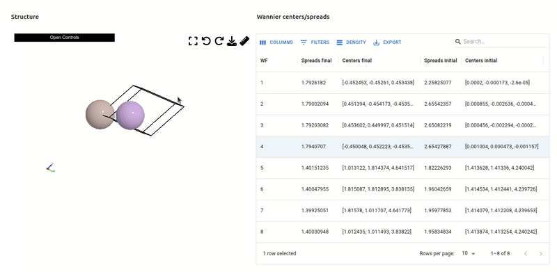

# aiidalab-qe-wannier90

A plugin for running Wannier calculations inside the AiiDAlab Quantum ESPRESSO App.

## Features

- **Band structure comparison** with DFT bands.
- With predefined protocols (`moderate`, `precise`, `fast`).
- **Optional real-space Wannier functions** (3D visualization) with the atomic structure.


<!--  -->


## Usage
Run Wannier calculations via the AiiDAlab QE App GUI.


## Compile Wanntier90

This plugin requires the Wannier90 code from the latest source code from the [Wannier90 GitHub repository](https://github.com/wannier-developers/wannier90).

To compile Wannier90, follow the instructions below:

```bash
git clone https://github.com/wannier-developers/wannier90.git
cd wannier90
sudo apt update
sudo apt install gfortran libblas-dev liblapack-dev
cp config/make.inc.gfort make.inc
make wannier
```


validate the installation by running the following command:

```bash
./wannier90.x -h
```


## Isosurface

I used PythonJob to calculate the isosurface of the wannier function, and save the mesh data as AiiDA output node, then visualize the isosurface using the `weas-widget`. This avoids the need to download and save the large density file.
